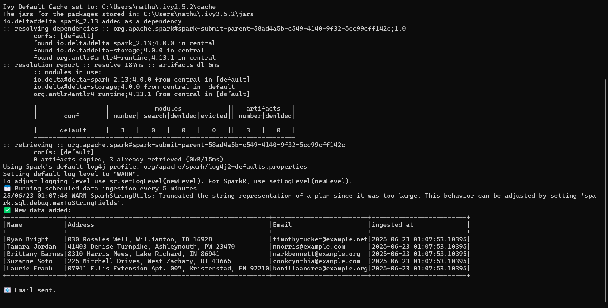
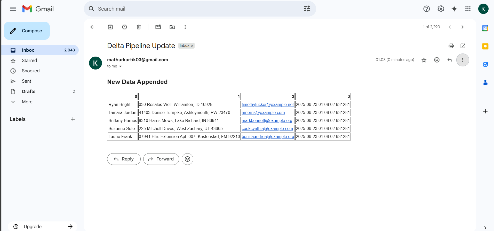

# Delta Lake Ingestion Pipeline

This is a Spark + Delta Lake data ingestion pipeline that runs locally.

---

## Features

-  Fake Data Generation  
  Automatically creates synthetic user data (`Name`, `Address`, `Email`).

-  Delta Table Integration
  Uses the Delta Lake API to write, read, and version Delta tables locally.

-  Incremental Appending
  Configurable number of rows appended at each run (e.g., every 5 minutes).

-  Version Tracking 
  Automatically retrieves and prints the latest version of the Delta table.

-  Timezone Aware Timestamps  
  Stores data with timezone-correct ingestion timestamps.

-  Automated Scheduling  
  Uses `schedule` library to run ingestion every 5 minutes.

-  Email Notification  
  Sends HTML summary of new data to your inbox after each ingestion.

---

## Dependencies

Install required packages using:

pip install -r requirements.txt

---

## Sample Output

### Terminal Output

### Email Notification

## How to Run the Delta Ingestion Pipeline
### Prerequisites:-

Python 3.10 installed

Java 8 (JDK 1.8) installed

Apache Spark configured with PySpark

winutils.exe and hadoop.dll placed in C:\hadoop\bin

PYSPARK_PYTHON environment variable set correctly

### Install Required Python Packages

pip install -r requirements.txt

### Run the Pipeline

python delta_ingestion.py

This will:

Generate fake data (Name, Address, Email)

Append to the Delta table

Track table versions

Show current data in the table

Send an email notification with new records

Repeat this process every 5 minutes (by default)

### Configuration (Optional)

Edit these variables in delta_ingestion.py to customize:

append_data(num_rows=5)    # Number of rows
schedule.every(5).minutes  # Time interval
